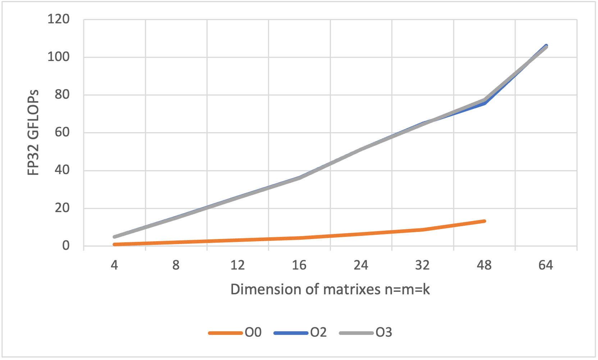

# HPC_week_3
## Homework for the 3rd week

### 4. Small GEMMs: Getting Started
#### 4.1 Matrix Kernels: Reference
For this exercise the variables of the leading dimensions were not implemented since they can be derived from the dimensions of the matrices together with the knowledge that for us the storage major is column major.

#### 4.2 Matrix Kernels: Measuring Performance
FMA operations of the form c = c + a $\cdot$ b can be splitted into two floating point operations, the multiplication and addition. Given the matrix dimensions M, N, K for every element in the result matrix c we need to do K$^2$ scalar multiplications for the matrix-matrix multiplication of A and B and one addition to add the result to the corresponding element in C. C has M$\cdot$N elements which leads to $\text{M} \cdot \text{N} \cdot (\text{K}^2 +1)$ floating point operations per matrix FMA operation.

The benchmarks for different matrix sizes in the form of 

$$
M=N=K=ldA=ldB=ldC=\lambda
$$

with

$$
\lambda \in \{ 4, 8, 12, 16, 24, 32, 48, 64\}
$$

give the results that are presented in the following:

**Optimization ```O0```**

<details>
  <summary> Output matrix FMA on single thread with compiler optimization O0 </summary>

```yaml
running GEMM microbenchmarks with m = 4, n = 4, k = 4
  duration: 1.56221 seconds
  average duration: 3.12443e-07 seconds
  GFLOPS: 0.870559
running GEMM microbenchmarks with m = 8, n = 8, k = 8
  duration: 10.4062 seconds
  average duration: 2.08124e-06 seconds
  GFLOPS: 1.99881
running GEMM microbenchmarks with m = 12, n = 12, k = 12
  duration: 33.5742 seconds
  average duration: 6.71485e-06 seconds
  GFLOPS: 3.10953
running GEMM microbenchmarks with m = 16, n = 16, k = 16
  duration: 77.7408 seconds
  average duration: 1.55482e-05 seconds
  GFLOPS: 4.2315
running GEMM microbenchmarks with m = 24, n = 24, k = 24
  duration: 257.837 seconds
  average duration: 5.15675e-05 seconds
  GFLOPS: 6.44499
running GEMM microbenchmarks with m = 32, n = 32, k = 32
  duration: 604.29 seconds
  average duration: 0.000120858 seconds
  GFLOPS: 8.68457
running GEMM microbenchmarks with m = 48, n = 48, k = 48
  duration: 2018.84 seconds
  average duration: 0.000403767 seconds
  GFLOPS: 13.1529
```

</details>

</br>

**Optimization ```O2```**

<details>
  <summary> Output matrix FMA on single thread with compiler optimization O2 </summary>

```yaml
running GEMM microbenchmarks with m = 4, n = 4, k = 4
  duration: 0.277884 seconds
  average duration: 5.55768e-08 seconds
  GFLOPS: 4.89413
running GEMM microbenchmarks with m = 8, n = 8, k = 8
  duration: 1.38183 seconds
  average duration: 2.76365e-07 seconds
  GFLOPS: 15.0526
running GEMM microbenchmarks with m = 12, n = 12, k = 12
  duration: 4.04708 seconds
  average duration: 8.09416e-07 seconds
  GFLOPS: 25.7964
running GEMM microbenchmarks with m = 16, n = 16, k = 16
  duration: 9.09417 seconds
  average duration: 1.81883e-06 seconds
  GFLOPS: 36.1726
running GEMM microbenchmarks with m = 24, n = 24, k = 24
  duration: 32.4141 seconds
  average duration: 6.48281e-06 seconds
  GFLOPS: 51.2666
running GEMM microbenchmarks with m = 32, n = 32, k = 32
  duration: 80.9114 seconds
  average duration: 1.61823e-05 seconds
  GFLOPS: 64.8611
running GEMM microbenchmarks with m = 48, n = 48, k = 48
  duration: 350.989 seconds
  average duration: 7.01978e-05 seconds
  GFLOPS: 75.6536
running GEMM microbenchmarks with m = 64, n = 64, k = 64
  duration: 790.673 seconds
  average duration: 0.000158135 seconds
  GFLOPS: 106.12
```

</details>

</br>

**Optimization ```O3```**

<details>
  <summary> Output matrix FMA on single core with compiler optimization O3 </summary>

```yaml
running GEMM microbenchmarks with m = 4, n = 4, k = 4
  duration: 0.276425 seconds
  average duration: 5.5285e-08 seconds
  GFLOPS: 4.91996
running GEMM microbenchmarks with m = 8, n = 8, k = 8
  duration: 1.38755 seconds
  average duration: 2.77509e-07 seconds
  GFLOPS: 14.9905
running GEMM microbenchmarks with m = 12, n = 12, k = 12
  duration: 4.08194 seconds
  average duration: 8.16389e-07 seconds
  GFLOPS: 25.5761
running GEMM microbenchmarks with m = 16, n = 16, k = 16
  duration: 9.15 seconds
  average duration: 1.83e-06 seconds
  GFLOPS: 35.9519
running GEMM microbenchmarks with m = 24, n = 24, k = 24
  duration: 32.445 seconds
  average duration: 6.48899e-06 seconds
  GFLOPS: 51.2178
running GEMM microbenchmarks with m = 32, n = 32, k = 32
  duration: 81.2621 seconds
  average duration: 1.62524e-05 seconds
  GFLOPS: 64.5811
running GEMM microbenchmarks with m = 48, n = 48, k = 48
  duration: 342.767 seconds
  average duration: 6.85534e-05 seconds
  GFLOPS: 77.4684
running GEMM microbenchmarks with m = 64, n = 64, k = 64
  duration: 796.454 seconds
  average duration: 0.000159291 seconds
  GFLOPS: 105.35
```

</details>

</br>

$\lambda$  | O0 | O2 | O3
------------- | ------------- | ------------- | -------------
4	| 0,870559 | 4,8941	| 4,9200
8	| 1,99881	| 15,0526	| 14,9905
12	| 3,10953	| 25,7964	| 25,5761
16	| 4,23150	| 36,1726	| 35,9519
24	| 6,44499	| 51,2666	| 51,2178
32	| 8,68457	| 64,8611	| 64,5811
48	| 13,15290	| 75,6536	| 77,4684
64	| 	| 106,12	| 105,35

*Table 1: Performance in FP32 GFLOPs for different matrix dimensions $\lambda$ and compiler optimizations Oi.*


*Figure 1: Performance in FP32 GFLOPs for matrix FMA with different sizes of matrices and different levels of compiler optimizations.*

Something that is noticable right away is that applying compiler optimization dramatically increases the performance of the resulting executable. Almost two orders of magnitude are reached for larger matrices. Also it is worth to mention, that the performance exceeds even the results that were obtained in the excercises of week 1 where scalar FMA was benchmarked. This seems a little strange, since these benchmarks were designed to put the maximum amount of pressure on the pipelines and get more or less the highes theoretical performance of the system as a result.

#### 4.3 Matrix Kernels: Helping the Compiler

This exercise included the optimization of the resulting machine code by transferring more high level information into the conversion from source code to the resulting executable. More concrete the task was to 
1. set the dimensions of all matrices to the static value 32
2. change the order in which the matrix elements are multiplied and added by reorganizing the according loops in the source code to $MNK$ and $NKM$.

The results can be found in the following. Again, different levels of optimization were applied (O0, O2, O3):

**Optimization ```O0```**

<details>
  <summary> Output of optimized matrix FMA on single thread with compiler optimization O0 </summary>

  ```yaml
  running mnk optimized GEMM microbenchmarks with m = n = k = 32
    duration: 582.757 seconds
    average duration: 0.000116551 seconds
    GFLOPS: 9.00546
  running nkm optimized GEMM microbenchmarks with m = n = k = 32
    duration: 583.204 seconds
    average duration: 0.000116641 seconds
    GFLOPS: 8.99857
  ```

</details>

</br>

**Optimization ```O2```**

<details>
  <summary> Output of optimized matrix FMA on single thread with compiler optimization O2 </summary>

  ```yaml
  running mnk optimized GEMM microbenchmarks with m = n = k = 32
    duration: 82.2413 seconds
    average duration: 1.64483e-05 seconds
    GFLOPS: 63.8122
  running nkm optimized GEMM microbenchmarks with m = n = k = 32
    duration: 82.2021 seconds
    average duration: 1.64404e-05 seconds
    GFLOPS: 63.8427
  ```

</details>

</br>

**Optimization ```O3```**

<details>
  <summary> Output of optimized matrix FMA on single thread with compiler optimization O3 </summary>

  ```yaml
  running mnk optimized GEMM microbenchmarks with m = n = k = 32
    duration: 82.2076 seconds
    average duration: 1.64415e-05 seconds
    GFLOPS: 63.8383
  running nkm optimized GEMM microbenchmarks with m = n = k = 32
    duration: 82.2059 seconds
    average duration: 1.64412e-05 seconds
    GFLOPS: 63.8397
  ```

</details>

</br>

Since the results are not really better than before something must have gone wrong. It is assumed that this is the case because one thought of optimization was implemented in the other kernels that probably does not get along with the backthought of the optimization steps, that were proposed in the exercise. For better cach awareness the matrix A was always transposed before the matrix multiplication was executed. The Background is that this way the elements of A that are multiplied by the elements of B lie right after each other in memory (like the elements of B). The result is less loads of whole cache lines and therefore faster execution. 
Let's try this again without this transposing of A and see what happens!

**Optimization ```O3``` without transposition of A**

<details>
  <summary> Output of optimized matrix FMA on single thread with compiler optimization O3 and no prior transposition of matrix A </summary>

  ```yaml
  running mnk optimized GEMM microbenchmarks with m = n = k = 32
  duration: 80.2813 seconds
  average duration: 1.60563e-05 seconds
  GFLOPS: 65.3702
running nkm optimized GEMM microbenchmarks with m = n = k = 32
  duration: 80.2794 seconds
  average duration: 1.60559e-05 seconds
  GFLOPS: 65.3717
  ```

</details>

</br>

It is observed that the performance increased by two GFLOPs compared to when matrix A is transposed additionally. This data shows that the proposed optimizations has a positive impact on the performance. Althoug, only the transposition of matrix A as optimization has only slightly worse performance and it is assumed that for larger matrices this optimization would outperform the suggested ones because of a better utilization of cach lines.